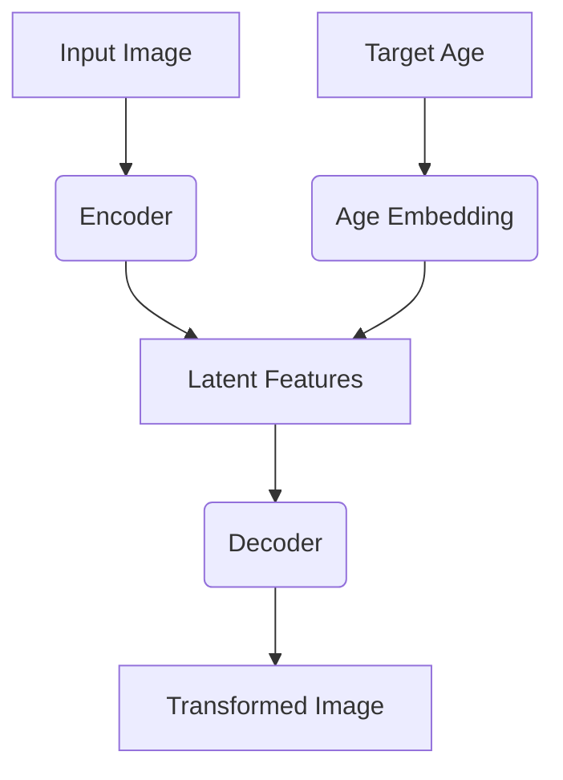

# ChronoFlux: Neural Age Transformation Model (WIP) ⏳🧬

[](https://opensource.org/licenses/Apache-2.0)
[](https://pytorch.org/)

<p align="center">
  
</p>

## Overview 🔍
ChronoFlux is a conditional GAN model that transforms facial images to target ages while preserving identity. Built with PyTorch and trained on the UTKFace dataset, this AI can:
- Age progression/regression with continuous age control
- Maintain facial identity features
- Generate high-quality 128x128 resolution images

## Features ✨
- 🎮 Conditional age control (0-100 years)
- 🤖 Hybrid U-Net architecture with age embeddings
- 📦 Easy Hugging Face Hub integration
- 🚀 Production-ready inference pipeline
- 🔧 Modular design for customization

## Installation ⚙️
```bash
pip install torch torchvision datasets huggingface_hub matplotlib numpy
```

## Usage 🚀
```python
from chronoflux import age_transformation
from PIL import Image

# Load from Hugging Face Hub
model = age_transformation.load_model("ParisNeo/ChronoFlux")

# Transform image
input_image = Image.open("person.jpg")
result = model.transform(
    image=input_image,
    target_age=65,  # Between 0-100
    output_size=256  # Upscale if needed
)

result.save("aged_person.jpg")
```

## Training 🏋️♂️
1. Clone repo:
```bash
git clone https://github.com/ParisNeo/ChronoFlux.git
cd scripts
```

2. Train model:
```python
python train.py \
  --dataset utk-face \
  --batch_size 32 \
  --epochs 100 \
  --resolution 128 \
  --output_dir results
```

## Model Architecture 🧠


## Contributing 🤝
We welcome contributions! Please see:
- [Contributing Guidelines](CONTRIBUTING.md)
- [Code of Conduct](CODE_OF_CONDUCT.md)

## License 📜
```
Copyright 2023 Your Name

Licensed under the Apache License, Version 2.0 (the "License");
you may not use this file except in compliance with the License.
You may obtain a copy of the License at

    http://www.apache.org/licenses/LICENSE-2.0

Unless required by applicable law or agreed to in writing, software
distributed under the License is distributed on an "AS IS" BASIS,
WITHOUT WARRANTIES OR CONDITIONS OF ANY KIND, either express or implied.
See the License for the specific language governing permissions and
limitations under the License.
```

## Acknowledgments 🌟
- UTKFace Dataset contributors
- PyTorch team
- Hugging Face community

---

**Ethical Note:** Use responsibly. Avoid generating content that could enable age discrimination or identity manipulation.
